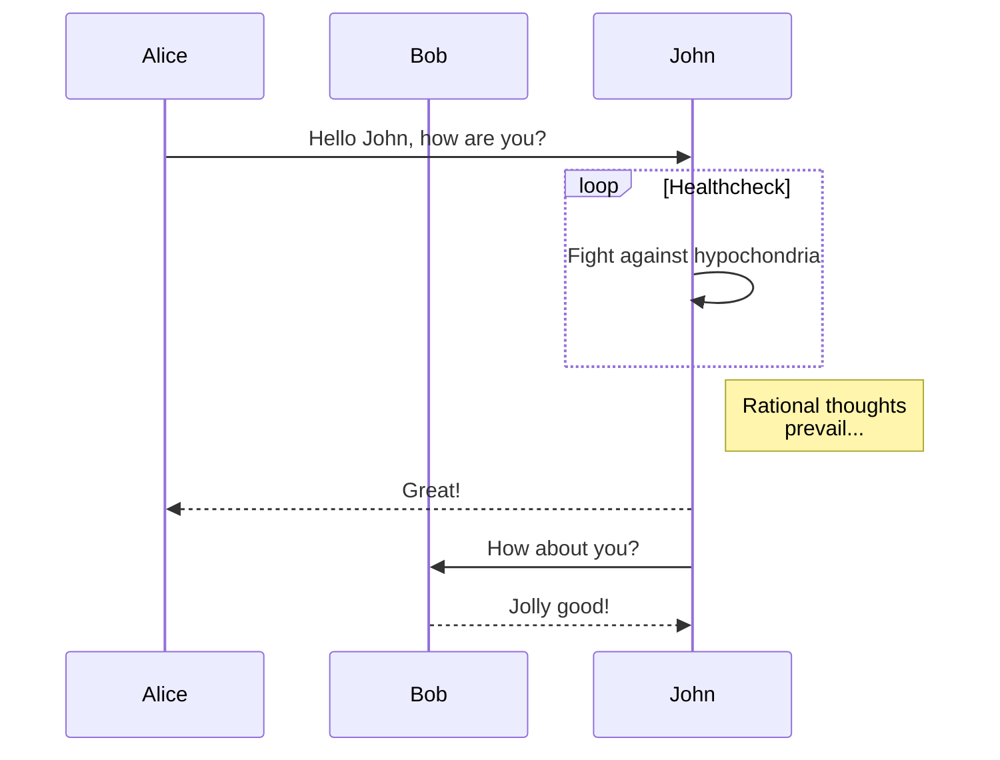
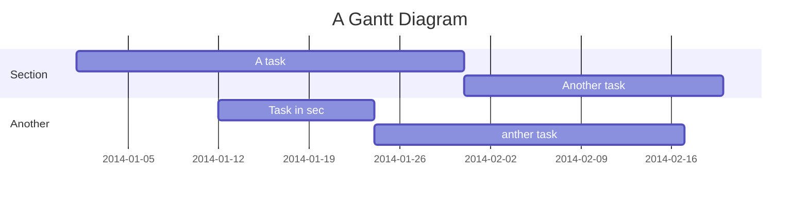
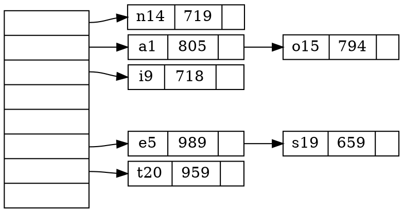
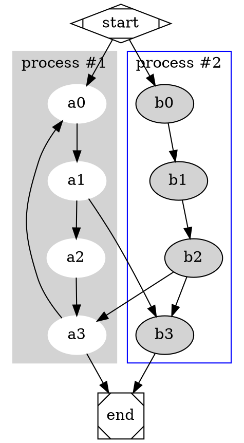

# Graph Visualization

Two graph visualization grammer are supported, mermaid and graphviz.
To enable these features, options `Mermaid` and/or `Graphviz` in `MacDown` -> `Perferences...` -> `Rendering` should be checked.

# Mermaid

[mermaid](https://github.com/knsv/mermaid) has 3 diagram syntax.

## Flow Chart

## Sequence Diagram

## Gantt

# Graphviz
> Graphviz is open source graph visualization software. Graph visualization is a way of representing structural information as diagrams of abstract graphs and networks. It has important applications in networking, bioinformatics,  software engineering, database and web design, machine learning, and in visual interfaces for other technical domains.

Please refer to [Graphviz website](http://www.graphviz.org/Home.php) for details.

## Graphviz Engines

* circo
* dot
* fdp
* neato
* osage
* twopi

Here are some samples.

## Hashmap

## Process diagram with clusters

